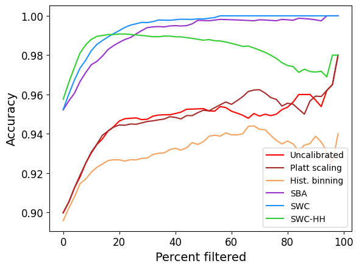
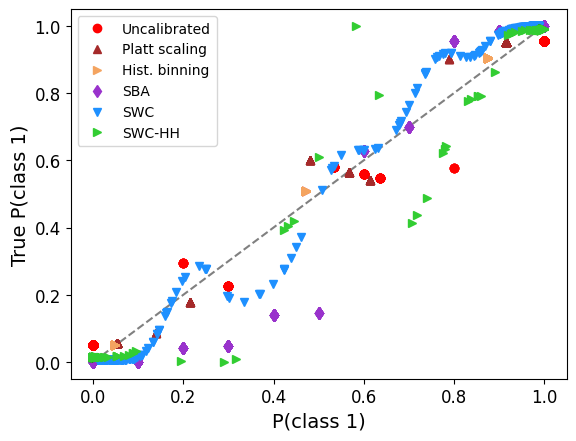

# Similarity-based Calibration

This repository contains an implementation of similarity-based
calibration methods.  The goal is to improve the calibration of
a classifier's predicted class probabilities; well-calibrated
predictions are those that match the true class probabilities.
The calibration methods in this reporitory update the predictions
(probabilities) while leveraging local similarity in feature space.
They include:
1. Similarity-Weighted Calibration (SWC)
2. Similarity-Weighted Calibration with Hidden Heterogeneity (SWC-HH)

## Installation
<!--pip3 install simcalib-->

```Console
$ python3 setup.py install
```

Dependencies:
* Python 3
* `numpy`
* `scipy`
* `matplotlib`
* `sklearn`
* `progressbar`
* `uncertainty-calibration`

## Overview

SWC and SWC-HH take in a set of test items `X_test` and their predicted
probability vectors `test_probs` (generated by a probabilistic
classifier) and construct an updated, calibrated probability vector
for each item.

These methods differ from global calibration methods such as Platt
scaling (Platt, 1999) or temperature scaling (Guo et al., 2017) in
that they individually calibrate each item and leverage local
information through its position in feature space.  For predictions
with large "hidden heterogeneity" (which can be measured in advance of
calibration), local calibration via SWC/SWC-HH tends to be advantageous.

## Using SWC for calibration

To use SWC to calibrate a model's predictions, first generate the item
representations in augmented feature space, which concatenates the
original feature space X with the probability vector:

```Python
>>> X_cal_aug = np.hstack((X_cal, cal_probs))
>>> X_test_aug = np.hstack((X_test, test_probs))
```

Assuming `nc` calibration items, `nt` test items, `c` classes, `d` dimensionality:
* `X_cal`: `nc`x`d` numpy array of calibration items
* `X_test`: `nt`x`d` numpy array of calibration items
* `cal_probs`: `nc`x`c` numpy array of predicted probabilities (per item, per class)
* `test_probs`: `nt`x`c` numpy array of predicted probabilities (per item, per class)

Then calibrate the probabilities with `calib_sim()`:

```Python
>>> import simcalib
>>> test_probs_calib, sim_mass = simcalib.calib_sim(X_cal_aug, y_cal, 
    cal_probs, X_test_aug, test_probs)
```

Arguments:
* `X_cal_aug`: `nc`x`(d + c)` numpy array of calibration items
* `y_cal`: `nc`x1 numpy array of calibration labels
* `cal_probs`: `nc`x`c` numpy array of predicted probabilities (per item, per class)
* `X_test_aug`: `nt`x`(d + c)` numpy array of test items
* `test_probs`: `nt`x`c` numpy array of predicted probabilities (per item, per class)

Return values:
* `test_probs_calib`: `nt`x`c` numpy array (the calibrated version of `test_probs`)
* `sim_mass`: `nt`x1 numpy array with a similarity mass for each test item 
  that indicates how much of the calibration set was relevant for
  calibrating that item.  Low values can indicate outliers or other
  items for which the calibration may be less reliable.

## Using SWC-HH for calibration

SWC-HH uses the hidden heterogeneity value for each test item to
filter the calibration set.  To use SWC-HH to calibrate a model's
predictions, first calculate the hidden heterogeneity (using the
original feature space) for each item using:

```Python
>>> import simcalib
>>> hh, n_neighbors, rfs = simcalib.hidden_hetero(X_cal, y_cal, 
    cal_probs, test_probs, r=0.1)
```

Arguments (given `nt` test items, `nc` calibration items, `c` classes, `d` dimensionality):
* `X_cal`: `nc`x`d` numpy array of calibration items
* `y_cal`: `nc`x1 numpy array of calibration labels
* `cal_probs`: `nc`x`c` numpy array of predicted probabilities (per item, per class)
* `test_probs`: `nt`x`c` numpy array of predicted probabilities (per item, per class)
* `r`: float >= 0 indicating probability simplex radius for neighborhood

Return values:
* `hh`: `nt`x` numpy array of hidden heterogeneity values for the 
  test set.  The larger the (average) `hh` value is, the more likely 
  that SWC/SWC-HH will out-perform global calibration methods.  The
  neighborhood radius `r` (in the probability simplex) influences the
  granularity of the hidden heterogeneity assessment.
* `n_neighbors`: a list that indicates, for each test item, 
  the number of items in the calibration set that fell within
  probability radius `r` for that test item.
* `rfs`: is a list that contains, for each item, the local 
  random forest that was used to estimate `hh` for that item.

Then calibrate the probabilities with `calib_sim()` using `hh` as an
additional input:

```Python
>>> import simcalib
>>> test_probs, sim_mass = simcalib.calib_sim(X_cal_aug, y_cal,
    cal_probs, X_test_aug, test_probs, hh=hh)
```

## Experiments

The `experiments` directory contains scripts that reproduce
experiments of interest.  Run any script with `--help` to see the full
set of options.

Additional dependencies:
* `matplotlib`: for plots
* `pandas`: to download the MNIST data set via openml

Use the `eval_calib.py` script to evaluate multiple calibration
methods on a given data set and classifier type.  **Modify the
`calib_methods` variable inside this script to specify the methods you
want to evaluate.** 

Example: Evaluate all calibration methods on a decision tree (DT)
trained to classify MNIST digits "4" vs. "9" with a total of 10k items
(500/1000/500 train/cal/test), random seed 0, and save results in
`res-test/`.  MNIST data will be downloaded to `data/uci`.  The output
directory will be created if it does not already exist.  Results are
saved in a `.pkl` file, and bar plots for Brier score and accuracy are
saved to `.pdf` files (use `-p` to suppress plots).

```Console
$ python3 experiments/eval_calib.py -d mnist-4v9 -n 1000 -c DT -s 0 res-test
```

Run 10 trials (per-trial plots suppressed with `-p`):

```Console
$ s=0; while [[ $s -lt 10 ]] ; do python3 experiments/eval_calib.py -d mnist-4v9 -n 1000 -c DT -p -s $s res-test ; s=$(( $s + 1 )) ; done
```

### Plotting results

Plot aggregate decision tree results over all trials:

```Console
$ python3 experiments/plot_results.py -d mnist-4v9 -n 1000 -c DT res-test
```

Plot of Brier score (lower is better):


This script also generates a rejection curve (higher is better):



Run 10 trials with a different classifier (random forest):

```Console
$ s=0; while [[ $s -lt 10 ]] ; do python3 experiments/eval_calib.py -d mnist-4v9 -n 1000 -c DT -p -s $s res-test ; s=$(( $s + 1 )) ; done
```

Plot aggregate results for a data set, with different classifier
types:

```Console
$ python3 experiments/plot_results_allclf.py -d mnist-4v9 -n 1000 res-test
```


Generate a reliability plot (using kernel density estimation, not
binning) for a single trial:

Additional dependencies:
* `KDEpy`: for kernel density estimation

```Console
$ python3 experiments/plot_reliability.py -d mnist-4v9 -c DT -n 1000 -s 0 res-test
```

For each test item, this script uses kernel density estimation to
estimate the accuracy as a function of the predicted probability
(Zhang et al., 2020).  Well calibrated predictions are near the
diagonal line, while predictions have above (or below) the line under-
(or over-) estimated probabilities.  Binary problems plot the
predicted vs. actual (estimated) probability of class 1.  Multi-class
problems plot the most likely class's probability vs. estimated
accuracy.



### Calibrating predictions from pre-trained models

The `eval_calib.py` script by default trains and evaluates models from
scratch. If you would like to calibrate predictions made by a pre-trained
model, you can do so as above in "Using SWC".  You will need:
* `cal_probs`, `test_probs`: numpy arrays with one row per item
containing one value per class
* `cal_logits`, `test_logits`: numpy arrays with one row per item
containing the logit values (for temperature scaling)
* `X_cal`, `X_test`: numpy arrays containing the feature
vector representation for the calibration and test items.

If your predictions are from a pre-trained deep neural network, you
can extract the feature representation for `X_cal` and `X_test` as
follows (recommended to run on a GPU machine).

CIFAR10 or CIFAR100 (using the test set):

```Console
$ python3 experiments/extract_from_pytorch.py -m resnet20 -d cifar10 data/cifar/cifar10_test_resnet20_
```

ImageNet (using the validation set):

```Console
$ python3 experiments/extract_from_pytorch.py -m resnet18 -d imagenet data/imagenet/val_resnet18_
```

Then load the corresponding files in Python:

```Python
>>> dataset = 'cifar10' # or 'cifar100'
>>> d = np.load('data/cifar/%s_test_%s_latent.npz' % (dataset, model_name))
>>> X = d['latent']
>>> y = np.genfromtxt('data/cifar/%s_test_%s_labels.csv' % (dataset, model_name))
>>> d = np.load('data/cifar/%s_test_%s_probs.npz' % (dataset, model_name))
>>> probs = d['probs']
>>> logits = np.load('data/cifar/%s_test_%s_logits.npz' % (dataset, model_name))
```

and split `X`, `y`, `probs`, and `logits` into calibration and test
sets as desired.

Supported pre-trained networks include:
* PyTorch's built-in ImageNet models (for resnet18 and resnet152)
* chenyaofo's CIFAR models (for resnet20, resnet56, and repvgg_a2)
from https://github.com/chenyaofo/pytorch-cifar-models

You can also use these generated files (if you used the naming
conventions above) with `eval_calib.py` by specifying a classifier
type that starts with "pretrained-" which will skip training and
simply evaluate calibration methods on the predictions:

```Console
$ python3 experiments/eval_calib.py -d cifar10 -n 1000 -c pretrained-repvgg_a2 -s 0 res-cnn
```

Finally, you can use one network's learned (latent) representation to
provide the basis for calibrating another.  To use ResNet56's
representation to calibrate ResNet20 predictions:

```Console
$ python3 experiments/eval_calib.py -d cifar10 -n 1000 -c pretrained-resnet56-resnet20 -s 0 res-cnn
```


## Questions, bugs, and contributions

Please feel free to ask questions, submit bug reports, or contribute
pull requests.  


## Authors

* Kiri Wagstaff, kiri.wagstaff@oregonstate.edu
* Thomas Dietterich, tgd@cs.orst.edu


## References

Chuan Guo, Geoff Pleiss, Yu Sun, and Kilian Q. Weinberger. On
calibration of modern neural networks. In Proceedings of the 34th
International Conference on Machine Learning, pages 132–1330, 2017. 

John Platt. Probabilistic outputs for support vector machines and
comparisons to regularized likelihood methods. Advances in Large
Margin Classifiers, 10(3):61–74, 1999. 

Jize Zhang, Bhavya Kailkhura, and T. Yong-Jin Han. Mix-n-match:
Ensemble and compositional methods for uncertainty calibration in
deep learning. In Proceedings of the 37th International Conference on
Machine Learning, pages 11117–11128, 2020.


## Acknowledgements

This work was supported by the Defense Advanced Research Projects
Agency (DARPA) under Contract No. HR001119C0112.
Any opinions, findings and conclusions or recommendations expressed in
this material are those of the author(s) and do not necessarily
reflect the views of the DARPA. 
